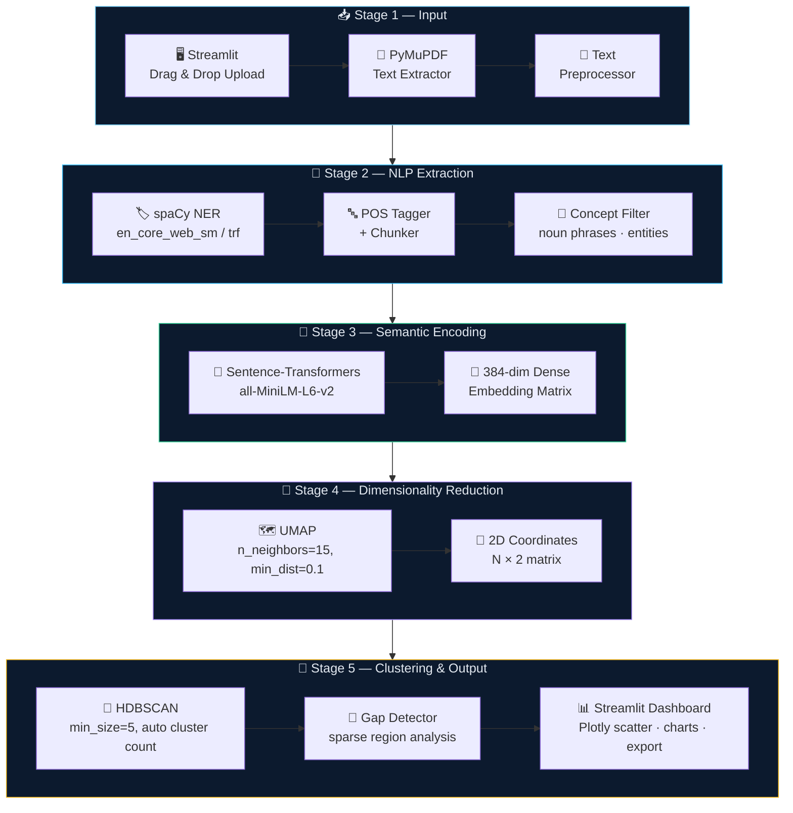
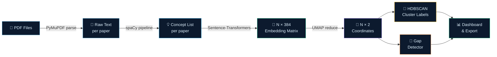
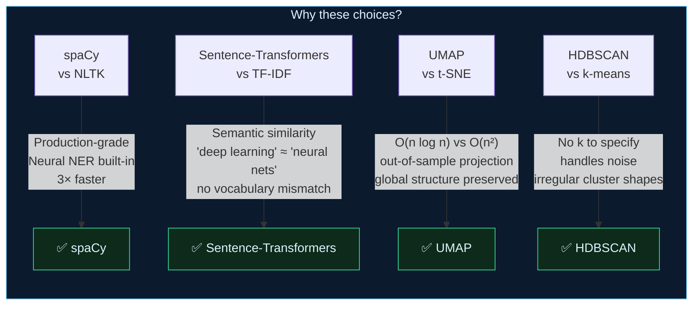
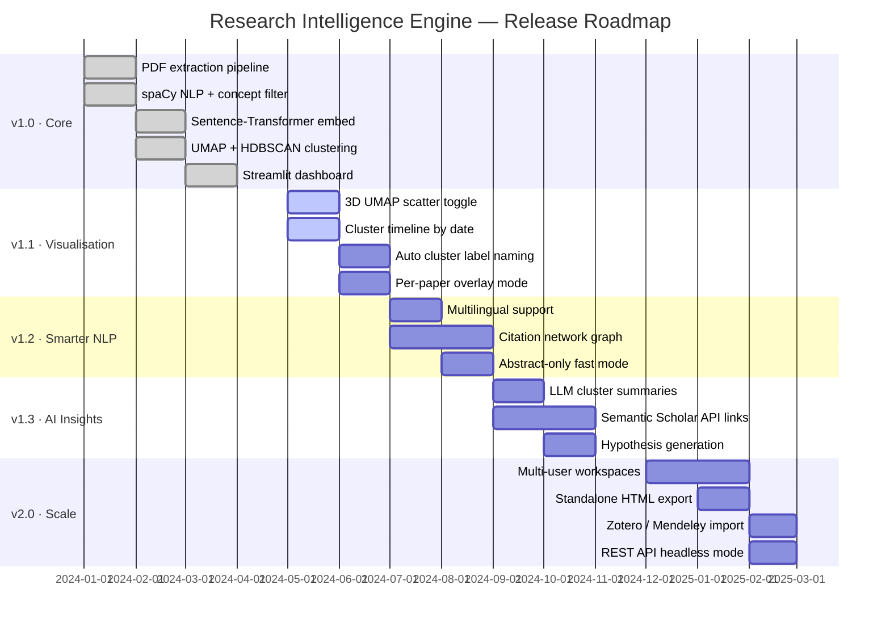

<div align="center">


<br/>


<br/>

<p>
  <a href="https://github.com/your-org/ai-research-engine/stargazers">
    
  </a>
  <a href="https://github.com/your-org/ai-research-engine/network">
    
  </a>
  
  
  
  
  
  
</p>

<p>
  
</p>

<br/>

> **An end-to-end ML pipeline that transforms raw academic PDFs into a visual research landscape —**  
> **revealing hidden concept clusters and unexplored research gaps automatically.**

<br/>

<p>
  <a href="#-demo">◎ Demo</a> &nbsp;·&nbsp;
  <a href="#-features">◎ Features</a> &nbsp;·&nbsp;
  <a href="#-architecture">◎ Architecture</a> &nbsp;·&nbsp;
  <a href="#-installation">◎ Install</a> &nbsp;·&nbsp;
  <a href="#-usage">◎ Usage</a> &nbsp;·&nbsp;
  <a href="#-configuration">◎ Config</a> &nbsp;·&nbsp;
  <a href="#-roadmap">◎ Roadmap</a>
</p>

</div>

<br/>

---

## 🧭 Navigation

<div align="center">

| | | | |
|:---:|:---:|:---:|:---:|
| [📸 Demo](#-demo) | [✨ Features](#-features) | [🏗️ Architecture](#️-architecture) | [🛠️ Tech Stack](#️-tech-stack) |
| [🚀 Installation](#-installation) | [📖 Usage](#-usage) | [⚙️ Configuration](#️-configuration) | [📊 Benchmarks](#-performance-benchmarks) |
| [🧪 Testing](#-running-tests) | [📁 Structure](#-project-structure) | [🗺️ Roadmap](#️-roadmap) | [🤝 Contributing](#-contributing) |

</div>

<br/>

---

## 📸 Demo


> Four PDFs loaded, clusters visualised, keywords extracted, and a research gap flagged automatically.

<div align="center">

</div>

<br/>

### 📟 What You're Seeing

<div align="center">

| Panel | What It Shows |
|:------|:--------------|
| 🗂️ **Left Sidebar** | PDF upload zone + live pipeline stage progress bars |
| 🌌 **Cluster Map** | UMAP 2D scatter — each dot = one concept, colour = cluster group |
| 📊 **Keyword Chart** | Top extracted terms ranked by cross-paper frequency |
| 🔭 **Gap Badge** | Automatically detected sparse regions = unexplored research territory |
| 🏷️ **Topic Summary** | Cluster labels with paper counts and dominant keywords |

</div>

<br/>

---

## ✨ Features


<table>
<tr>
<td width="50%" valign="top">

### 📄 PDF Text Extraction
Fast, accurate text parsing via **PyMuPDF**. Handles multi-column layouts, footnotes, and reference sections. Strips boilerplate and formatting noise automatically — paragraph-level, not page-level.

</td>
<td width="50%" valign="top">

### 🧠 Key Concept Extraction
**spaCy NLP pipeline** identifies named entities (methods, datasets, institutions), noun phrases, and domain-specific keywords with full POS tagging and neural NER.

</td>
</tr>
<tr>
<td width="50%" valign="top">

### 🔢 Semantic Embeddings
**Sentence-Transformers** encode every extracted concept into a **384-dimensional dense vector**, capturing deep semantic meaning far beyond simple keyword matching.

</td>
<td width="50%" valign="top">

### 🗺️ UMAP Dimensionality Reduction
Projects high-dimensional embedding space to **2D** while preserving local structure — making semantic similarity visually intuitive and explorable on an interactive map.

</td>
</tr>
<tr>
<td width="50%" valign="top">

### 🔵 HDBSCAN Clustering
Density-based hierarchical clustering that **automatically determines cluster count** — no `k` to guess. Noise points are identified and flagged as isolated concepts.

</td>
<td width="50%" valign="top">

### 🔭 Research Gap Detection
Sparse regions in the cluster map = topics with minimal coverage. The engine **surfaces these automatically** as high-value research opportunities with spatial context.

</td>
</tr>
<tr>
<td width="50%" valign="top">

### 📊 Interactive Visualisations
**Plotly-powered** scatter plots, bar charts, and cluster summaries. Hover any dot to see the concept text and source paper. Export to HTML, CSV, or PDF.

</td>
<td width="50%" valign="top">

### ⚡ Zero-Config Streamlit UI
Drag-and-drop PDF upload, live pipeline progress indicators, and instant cluster refresh — **no terminal commands** required after initial setup.

</td>
</tr>
</table>

<br/>

---

## 🏗️ Architecture


> The pipeline runs in **five sequential, independently-testable stages**. Each module is replaceable without touching the others.

### 🌐 Full System Diagram



<br/>

### 🔄 End-to-End Data Flow



<br/>

### 🧱 Stage-by-Stage Detail

```
╔══════════════════════════════════════════════════════════════════════════╗
║  ◎  STAGE 1 — INPUT & EXTRACTION                                        ║
╠══════════════════════════════════════════════════════════════════════════╣
║                                                                          ║
║   [ PDF Upload ]  ──►  [ PyMuPDF Extractor ]  ──►  [ Text Preprocessor ]║
║     Streamlit           Fast C-bindings           Strip boilerplate      ║
║     drag & drop         multi-column aware        paragraph splitting    ║
║                                                                          ║
╠══════════════════════════════════════════════════════════════════════════╣
║  ◎  STAGE 2 — NLP CONCEPT EXTRACTION                                    ║
╠══════════════════════════════════════════════════════════════════════════╣
║                                                                          ║
║   [ spaCy NER ]  ──►  [ POS Tagging + Chunking ]  ──►  [ Filter ]       ║
║     en_core_web         noun phrases                   min length        ║
║     neural NER          entity labels                  max per paper     ║
║                         dependency parse               domain stopwords  ║
║                                                                          ║
╠══════════════════════════════════════════════════════════════════════════╣
║  ◎  STAGE 3 — SEMANTIC ENCODING                                         ║
╠══════════════════════════════════════════════════════════════════════════╣
║                                                                          ║
║   [ all-MiniLM-L6-v2 ]  ──────────────────────────────────────────────  ║
║     384-dimensional dense embedding per concept                          ║
║     "deep learning" ≈ "neural networks" (captured by cosine similarity)  ║
║     batch_size = 64  ·  supports CPU + CUDA                              ║
║                                                                          ║
╠══════════════════════════════════════════════════════════════════════════╣
║  ◎  STAGE 4 — DIMENSIONALITY REDUCTION                                  ║
╠══════════════════════════════════════════════════════════════════════════╣
║                                                                          ║
║   UMAP  384-dim  ──────────────────────────────────►  2-dim             ║
║         n_neighbors = 15  (global vs local structure balance)            ║
║         min_dist    = 0.1  (cluster separation tightness)                ║
║         metric      = cosine  (best for embedding spaces)                ║
║                                                                          ║
╠══════════════════════════════════════════════════════════════════════════╣
║  ◎  STAGE 5 — CLUSTERING + GAP DETECTION + OUTPUT                       ║
╠══════════════════════════════════════════════════════════════════════════╣
║                                                                          ║
║   [ HDBSCAN ]  ──►  [ Gap Analyser ]  ──►  [ Dashboard ]                ║
║     auto cluster       density grid         Plotly scatter               ║
║     count discovery    sparse regions       keyword bars                 ║
║     noise flagging     gap reporting        CSV/JSON/PDF export           ║
║                                                                          ║
╚══════════════════════════════════════════════════════════════════════════╝
```

<br/>

### 🔍 Concept Cluster Interpretation

```
  TIGHT CLUSTER          LOOSE CLUSTER         ISOLATED POINTS
  ─────────────          ─────────────         ───────────────
  ● ● ●                  ●     ●               ·
  ● ● ●                    ●     ●             Strong research theme
  ● ● ●                  ●   ●                 · · ·         heavily studied
  Emerging or fragmented         Noise — concepts not
  topic area                     fitting any cluster

  GAP ZONE
  ─────────
  [ cluster A ]    ·  ·  ·  ·  [ cluster B ]
                  ↑ sparse space ↑
                  Research opportunity flagged by engine
```

<br/>

---

## 🛠️ Tech Stack


```
╔══════════════════════════════════════════════════════════════════════════╗
║  ◎  RESEARCH INTELLIGENCE ENGINE  ·  TECHNOLOGY STACK                   ║
╠══════════════════════╦═══════════════════════╦═══════════════════════════╣
║  CORE NLP            ║  ML / EMBEDDINGS      ║  DIMENSIONALITY           ║
╠══════════════════════╬═══════════════════════╬═══════════════════════════╣
║  spaCy        3.7+   ║  sentence-transformers║  umap-learn     0.5+      ║
║  en_core_web_sm      ║    2.6+               ║  hdbscan        0.8+      ║
║  en_core_web_trf     ║  all-MiniLM-L6-v2     ║  scikit-learn   1.3+      ║
║                      ║  PyTorch (backend)    ║  numpy          1.26+     ║
╠══════════════════════╬═══════════════════════╬═══════════════════════════╣
║  PDF PARSING         ║  VISUALISATION        ║  UI & SERVING             ║
╠══════════════════════╬═══════════════════════╬═══════════════════════════╣
║  PyMuPDF     1.23+   ║  plotly       5.18+   ║  streamlit      1.32+     ║
║  (fitz)              ║  matplotlib   3.8+    ║  streamlit-     0.4+      ║
║                      ║  seaborn      0.13+   ║    extras                 ║
╠══════════════════════╬═══════════════════════╬═══════════════════════════╣
║  DATA                ║  TESTING              ║  UTILITIES                ║
╠══════════════════════╬═══════════════════════╬═══════════════════════════╣
║  pandas      2.1+    ║  pytest       7.x     ║  tqdm           4.66+     ║
║  numpy       1.26+   ║  coverage     7.x     ║  python-dotenv  1.x       ║
║  scipy       1.11+   ║  black        23.x    ║  pydantic       2.x       ║
╚══════════════════════╩═══════════════════════╩═══════════════════════════╝
```

<br/>

### 🧩 Design Decisions



<br/>

---

## 🚀 Installation


> **Requirements:** Python 3.9+ · pip · 4 GB RAM minimum (8 GB recommended)

### ⚡ Quick launch (5 steps)

```bash
# 1 ── Clone
git clone https://github.com/your-org/ai-research-engine.git
cd ai-research-engine

# 2 ── Create isolated environment
python -m venv venv
source venv/bin/activate          # macOS / Linux
.\venv\Scripts\activate           # Windows PowerShell

# 3 ── Install all dependencies
pip install --upgrade pip
pip install -r requirements.txt

# 4 ── Download the spaCy language model
python -m spacy download en_core_web_sm    # lightweight (recommended)
# python -m spacy download en_core_web_trf # transformer-based (better NER)

# 5 ── Launch 🚀
streamlit run app.py
#  ✅  Opens automatically at http://localhost:8501
```

> 💡 **First run note:** Sentence-Transformers downloads `all-MiniLM-L6-v2` (~80 MB) on first launch. Cached locally — all subsequent starts are instant.

### 🐳 Docker (one command)

```bash
docker-compose up --build
# App available at http://localhost:8501
```

<details>
<summary><b>🔧 Conda environment alternative</b></summary>

```bash
conda create -n research-engine python=3.10
conda activate research-engine
pip install -r requirements.txt
python -m spacy download en_core_web_sm
streamlit run app.py
```

</details>

<br/>

---

## 📖 Usage


### 🗂️ Basic workflow

```
  Step 1   Open http://localhost:8501 in your browser
           │
  Step 2   Drag & drop 3 or more PDF research papers into the sidebar
           │
  Step 3   Watch pipeline indicators update in real time:
           │
           │   [✓] Extracting text ................ done
           │   [✓] Running NLP concepts ........... done
           │   [✓] Encoding embeddings ............. done
           │   [✓] Running UMAP projection ......... done
           │   [✓] Clustering with HDBSCAN ......... done
           │
  Step 4   Explore the Research Cluster scatter plot
           │   · Each dot  = one extracted concept
           │   · Colour    = cluster membership
           │   · Hover     = concept text + source paper name
           │
  Step 5   Review the Keyword Frequency bar chart
           │
  Step 6   Check the Research Gap panel for unexplored topic suggestions
           │
  Step 7   Export results (CSV / JSON / PDF) from sidebar export panel
```

<br/>

### 💡 Tips for Best Results

<div align="center">

| Tip | Detail |
|:----|:-------|
| 📚 **Use 5–20 papers** | Fewer than 3 gives no clusters. More than 50 slows the NLP step noticeably. |
| 🎯 **Same domain = tighter clusters** | Upload papers from one field for meaningful, interpretable groupings. |
| 🌐 **Cross-domain = bridges** | Mix domains to discover interdisciplinary connections and unexpected links. |
| 📄 **Long papers welcome** | Handles 30+ page papers — extraction is paragraph-level, not page-level. |
| 📝 **Preprints supported** | arXiv PDFs work perfectly; formatting quirks are handled automatically. |
| 🔄 **Reload after adding PDFs** | Hit Rerun in the sidebar to refresh clusters with newly added papers. |

</div>

<br/>

### 📤 Export Formats

<div align="center">

| Format | Contents |
|:-------|:---------|
| 📊 **Cluster CSV** | concept · cluster ID · x/y coordinates · source paper filename |
| 🗄️ **Keywords JSON** | frequency-ranked keyword list, optionally per-cluster |
| 📋 **Gap Report PDF** | auto-generated summary of detected research gaps with cluster context |

</div>

<br/>

---

## ⚙️ Configuration


### `config.py` — Full Reference

```python
# ═══════════════════════════════════════════════════════════════════
#  RESEARCH INTELLIGENCE ENGINE  ·  CONFIGURATION
# ═══════════════════════════════════════════════════════════════════

# ── NLP ─────────────────────────────────────────────────────────────
SPACY_MODEL             = "en_core_web_sm"    # or "en_core_web_trf"
MIN_CONCEPT_LENGTH      = 3                   # discard short concepts
MAX_CONCEPTS_PER_PAPER  = 500                 # cap per document
INCLUDE_NOUN_CHUNKS     = True                # extract noun phrases
INCLUDE_NAMED_ENTITIES  = True                # extract NER entities
STOP_WORDS_EXTRA        = []                  # domain-specific extras

# ── Embeddings ──────────────────────────────────────────────────────
EMBEDDING_MODEL         = "all-MiniLM-L6-v2"
EMBEDDING_BATCH_SIZE    = 64                  # reduce to 16 if OOM
EMBEDDING_DEVICE        = "cpu"               # or "cuda" for GPU
EMBEDDING_CACHE_DIR     = "./models"

# ── UMAP ────────────────────────────────────────────────────────────
UMAP_N_NEIGHBORS        = 15                  # larger = more global structure
UMAP_MIN_DIST           = 0.1                 # smaller = tighter clusters
UMAP_N_COMPONENTS       = 2                   # 2 for 2D, 3 for 3D scatter
UMAP_METRIC             = "cosine"            # best for embedding spaces
UMAP_RANDOM_STATE       = 42                  # reproducible layouts

# ── HDBSCAN ─────────────────────────────────────────────────────────
HDBSCAN_MIN_CLUSTER_SIZE    = 5               # concepts per cluster minimum
HDBSCAN_MIN_SAMPLES         = 3               # noise sensitivity
HDBSCAN_CLUSTER_SELECTION   = "eom"           # or "leaf" for finer clusters

# ── Gap Detection ───────────────────────────────────────────────────
GAP_DENSITY_THRESHOLD   = 0.05                # cells below this = gap
GAP_GRID_RESOLUTION     = 50                  # density estimation resolution
GAP_MIN_AREA            = 0.02                # minimum gap area to report

# ── UI ──────────────────────────────────────────────────────────────
MAX_UPLOAD_SIZE_MB      = 50
MAX_FILES               = 30
TOP_KEYWORDS            = 20
SCATTER_POINT_SIZE      = 5
SCATTER_OPACITY         = 0.75
```

### Environment Variable Overrides

```bash
export EMBEDDING_DEVICE=cuda          # GPU: 5–8× faster embedding
export SPACY_MODEL=en_core_web_trf    # better NER accuracy
export MAX_UPLOAD_SIZE_MB=200         # larger per-file limit

streamlit run app.py
```

<details>
<summary><b>🎨 Streamlit Dark Theme — <code>.streamlit/config.toml</code></b></summary>

```toml
[server]
maxUploadSize = 100
port = 8501
headless = false

[theme]
primaryColor          = "#7dd3fc"
backgroundColor       = "#0a0c10"
secondaryBackgroundColor = "#0c1a2e"
textColor             = "#e2e8f0"
font                  = "monospace"
```

</details>

<br/>

---

## 📊 Performance Benchmarks


> Tested on MacBook Pro M2, 16 GB RAM, CPU only, `all-MiniLM-L6-v2` model.

```
╔═══════════╦══════════╦═══════════╦════════╦══════════╦══════════╗
║  Papers   ║ Concepts ║ Embedding ║  UMAP  ║ HDBSCAN  ║  Total   ║
╠═══════════╬══════════╬═══════════╬════════╬══════════╬══════════╣
║     3     ║   ~450   ║    4 s    ║   1 s  ║  < 1 s   ║   ~6 s   ║
║    10     ║  ~1,500  ║   12 s    ║   3 s  ║    1 s   ║  ~16 s   ║
║    20     ║  ~3,000  ║   24 s    ║   7 s  ║    2 s   ║  ~33 s   ║
║    50     ║  ~7,500  ║   58 s    ║  18 s  ║    5 s   ║  ~81 s   ║
╚═══════════╩══════════╩═══════════╩════════╩══════════╩══════════╝
```

> 💡 Set `EMBEDDING_DEVICE=cuda` to cut embedding time by **5–8×** on a modern GPU.

<br/>

---

## 🧪 Running Tests


```bash
# Full test suite
pytest tests/

# Verbose output
pytest tests/ -v

# With HTML coverage report
pytest tests/ --cov=pipeline --cov-report=html
open htmlcov/index.html

# Single module
pytest tests/test_clusterer.py -v

# Stop on first failure
pytest tests/ -x

# Filter by keyword
pytest tests/ -k "cluster"
```

### Coverage Targets

<div align="center">

| Module | Target | Focus |
|:-------|:------:|:------|
| `extractor.py` | ≥ 90% | Multi-column PDFs, empty pages, encoding edge cases |
| `nlp.py` | ≥ 85% | Entity extraction, noun chunks, stop-word filtering |
| `embedder.py` | ≥ 80% | Batch processing, device fallback, cache behaviour |
| `reducer.py` | ≥ 80% | UMAP parameters, determinism, output shape |
| `clusterer.py` | ≥ 85% | Noise labelling, min_size edge cases, label stability |
| `gap_detector.py` | ≥ 80% | Density grid, threshold sensitivity, min area filter |

</div>

<br/>

---

##  Project Structure


```
📦 ai-research-engine/
│
├── 🌐 ENTRY POINTS
│   ├── 📄 app.py                         # Streamlit application entry point
│   ├── 📄 config.py                      # All pipeline configuration constants
│   └── 📄 requirements.txt               # Python dependency manifest
│
├── 🤖 PIPELINE CORE  (pipeline/)
│   ├── 📄 __init__.py
│   ├── 📄 extractor.py                   # PDF → raw text (PyMuPDF)
│   ├── 📄 nlp.py                         # spaCy concept extraction
│   ├── 📄 embedder.py                    # Sentence-Transformer encoding
│   ├── 📄 reducer.py                     # UMAP dimensionality reduction
│   ├── 📄 clusterer.py                   # HDBSCAN topic clustering
│   └── 📄 gap_detector.py                # Sparse region analysis
│
├── 🎨 UI COMPONENTS  (ui/)
│   ├── 📄 __init__.py
│   ├── 📄 sidebar.py                     # Upload panel + progress bars
│   ├── 📄 scatter_plot.py                # Interactive cluster scatter
│   ├── 📄 keyword_chart.py               # Keyword frequency bar chart
│   ├── 📄 gap_panel.py                   # Research gap display widget
│   └── 📄 export.py                      # CSV / JSON / PDF export logic
│
├── ✅ TESTS  (tests/)
│   ├── 📄 __init__.py
│   ├── 📄 test_extractor.py
│   ├── 📄 test_nlp.py
│   ├── 📄 test_embedder.py
│   ├── 📄 test_clusterer.py
│   ├── 📄 test_gap_detector.py
│   └── 📁 fixtures/
│       └── 📄 sample_paper.pdf           # Sample PDF used in tests
│
├── 📓 NOTEBOOKS  (notebooks/)
│   ├── 📄 01_pipeline_exploration.ipynb
│   ├── 📄 02_embedding_visualisation.ipynb
│   └── 📄 03_clustering_experiments.ipynb
│
├── 💾 RUNTIME (gitignored)
│   ├── 📁 models/                        # Cached model weights
│   └── 📁 data/                          # Temporary uploaded PDFs
│
└── 📄 .streamlit/config.toml             # Streamlit server + theme config
```

<br/>

---

## 🗺️ Roadmap




<br/>

---

## 🔧 Troubleshooting


<details>
<summary><b>  ModuleNotFoundError: No module named 'fitz'</b></summary>

```bash
pip install PyMuPDF
```
</details>

<details>
<summary><b>  OSError: Can't find model 'en_core_web_sm'</b></summary>

```bash
python -m spacy download en_core_web_sm
```
</details>

<details>
<summary><b> CUDA out of memory</b></summary>

```bash
export EMBEDDING_DEVICE=cpu        # fall back to CPU
# or in config.py: EMBEDDING_BATCH_SIZE = 16
```
</details>

<details>
<summary><b> ValueError: Need at least 3 PDFs for clustering</b></summary>

Upload at least 3 papers. HDBSCAN needs sufficient data points to form density clusters. 5–10 papers is the recommended minimum for useful results.
</details>

<details>
<summary><b>  Streamlit: File size exceeds the limit</b></summary>

```toml
# .streamlit/config.toml
[server]
maxUploadSize = 200
```
</details>

<details>
<summary><b>  Cluster map shows one single large blob</b></summary>

```python
# config.py — try these more aggressive separation settings
UMAP_N_NEIGHBORS = 5      # was 15
UMAP_MIN_DIST    = 0.05   # was 0.1
```
</details>

<details>
<summary><b> All concepts assigned to noise (cluster = -1)</b></summary>

```python
# config.py — relax the clustering constraints
HDBSCAN_MIN_CLUSTER_SIZE = 3   # was 5
HDBSCAN_MIN_SAMPLES      = 1   # makes algorithm less conservative
```
</details>

<details>
<summary><b> App is very slow on large paper sets</b></summary>

```bash
export EMBEDDING_DEVICE=cuda             # GPU acceleration
# config.py:
MAX_CONCEPTS_PER_PAPER = 200             # reduce concept load
SPACY_MODEL = "en_core_web_sm"           # use lightweight model
```
</details>

<br/>

---

## 🤝 Contributing


```bash
# Fork → Clone → Branch → Code → Test → PR

git clone https://github.com/YOUR-USERNAME/ai-research-engine.git
cd ai-research-engine

pip install -e ".[dev]"
pre-commit install                           # black + flake8 on every commit

git checkout -b feature/3d-umap-scatter

# Make changes, then verify
pytest tests/ -v
flake8 pipeline/ ui/
black pipeline/ ui/ --check

git commit -m "feat: add 3D UMAP scatter toggle"
git push origin feature/3d-umap-scatter
# → Open Pull Request on GitHub
```

### Commit Message Format

We follow [Conventional Commits](https://www.conventionalcommits.org/):

<div align="center">

| Prefix | When to use |
|:------:|:------------|
| `feat:` | New feature or capability |
| `fix:` | Bug fix |
| `docs:` | Documentation only |
| `refactor:` | Code restructure, no behaviour change |
| `test:` | Adding or fixing tests |
| `perf:` | Performance improvement |
| `chore:` | Tooling, CI, dependency updates |

</div>

### Pull Request Checklist

- [ ] `pytest tests/` passes with no failures
- [ ] `black .` has been run — code is formatted
- [ ] `flake8 .` shows no errors
- [ ] New functions include docstrings
- [ ] `CHANGELOG.md` updated if user-facing behaviour changed
- [ ] Screenshots attached if the PR touches any UI component

<br/>

---

## 🙏 Acknowledgements

<div align="center">

| Library | Role |
|:--------|:-----|
| [spaCy](https://spacy.io/) | Industrial-strength NLP — tokenisation, NER, POS tagging |
| [Sentence-Transformers](https://www.sbert.net/) | State-of-the-art semantic text embeddings |
| [UMAP](https://umap-learn.readthedocs.io/) | Fast, structure-preserving dimensionality reduction |
| [HDBSCAN](https://hdbscan.readthedocs.io/) | Robust density-based clustering without fixed k |
| [Streamlit](https://streamlit.io/) | Zero-friction Python web app framework |
| [PyMuPDF](https://pymupdf.readthedocs.io/) | Fast, accurate PDF text extraction |
| [Plotly](https://plotly.com/) | Interactive, publication-quality visualisations |

</div>

<br/>

---

<div align="center">

```
  ◎ ─────────────────────────────────────────────────────────── ◎
                        MIT LICENSE
  Copyright © 2026 AI Research Paper Intelligence Engine Contributors
  Free to use, modify, and distribute with attribution.
  ◎ ─────────────────────────────────────────────────────────── ◎
```

<br/>

[](https://github.com/your-org/ai-research-engine)
&nbsp;&nbsp;
[](https://github.com/your-org/ai-research-engine/fork)
&nbsp;&nbsp;
[](https://github.com/your-org/ai-research-engine/issues)
&nbsp;&nbsp;
[](https://github.com/your-org/ai-research-engine/discussions)

<br/>


<br/>

<sub>
◎ &nbsp; Built with ❤️ using spaCy · Sentence-Transformers · HDBSCAN · Streamlit
&nbsp;·&nbsp;
MIT License
&nbsp;·&nbsp;
2024
&nbsp; ◎
</sub>

</div>
